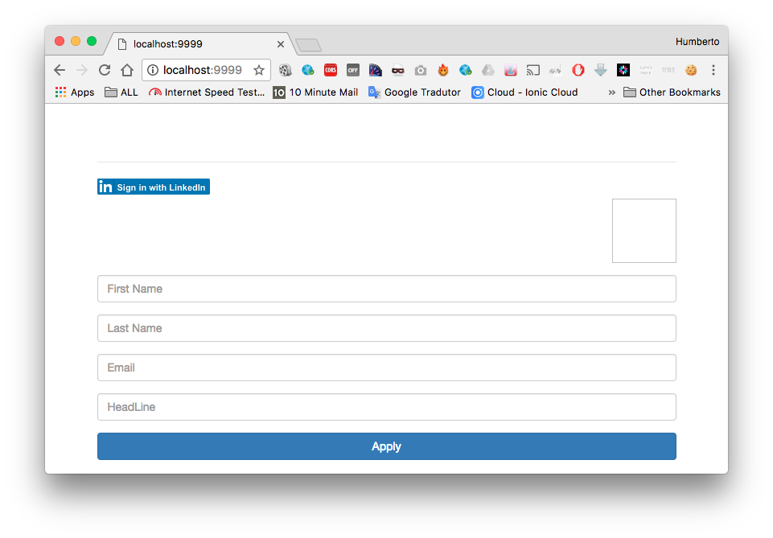
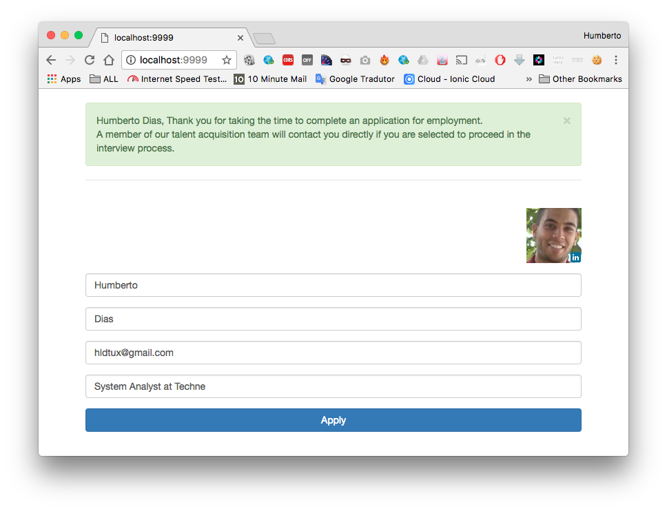

#  LinkedIn auto fill Form

Using LinkedIn JavaScript API for User Authentication and Profile Retrieval.


## Prerequires

1. http-server


## Run

Clone

```
git clone https://github.com/humbertodias/js-linkedin-auto-fill-form.git
```

Inside

```
cd js-linkedin-auto-fill-form
```

Start Server

```
npm install
PORT=9999 node app.js
```

Browser

```
http://localhost:9999
```

Unfilled, click on sign in with LinkedIn



Authentication


Filled




Demo


## References

1. [Getting Started with the JavaScript SDK](https://developer.linkedin.com/docs/getting-started-js-sdk#initialize)

2. [Using LinkedIn JavaScript API for User Authentication and Profile Retrieval](http://www.developer.com/lang/jscript/using-linkedin-javascript-api-for-user-authentication-and-profile-retrieval.html)


